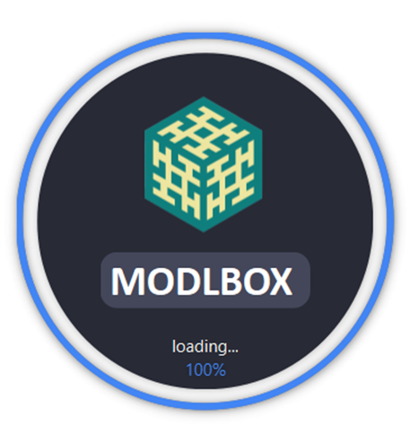
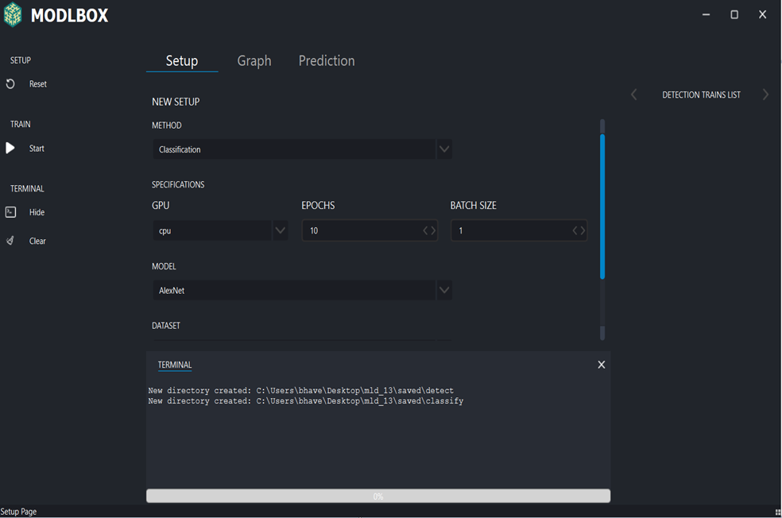
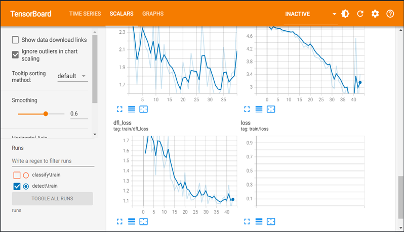
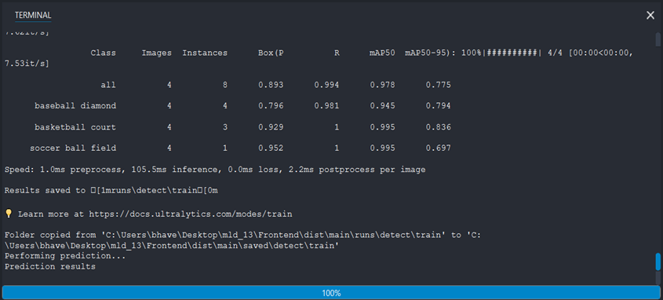
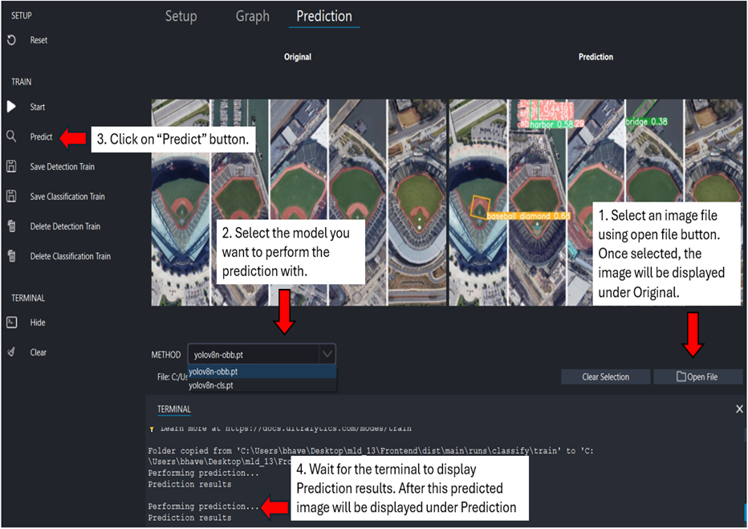

# MLD_13

About MODLBOX
MODLBOX is an application to speed up the Machine learning/deep learning development lifecycle. It aims to provide an intuitive user interface and is helpful for people with limited coding experience. 

(Windows Only) App download link: https://iastate.box.com/s/mw2hr7j1lj6h71dieth2kzyn6osv6vnx 

Loading screen when the app is launched

Home Screen

Live Graph 

Terminal

Prediction of trained model

BEFORE STARTING THE APP: 

User should uninstall previous python installed on their computer. Install the latest version of python from:
https://www.python.org/downloads/

After installing python, run the following commands on the command prompt:

pip install ultralytics
pip install tensorboard

You are ready to launch the app!!!

CLOSING THE APP:
If you accidently close the console first. Remember to delete app.lock from the folder else you won't be able 
to open the MODLBOX app again.

